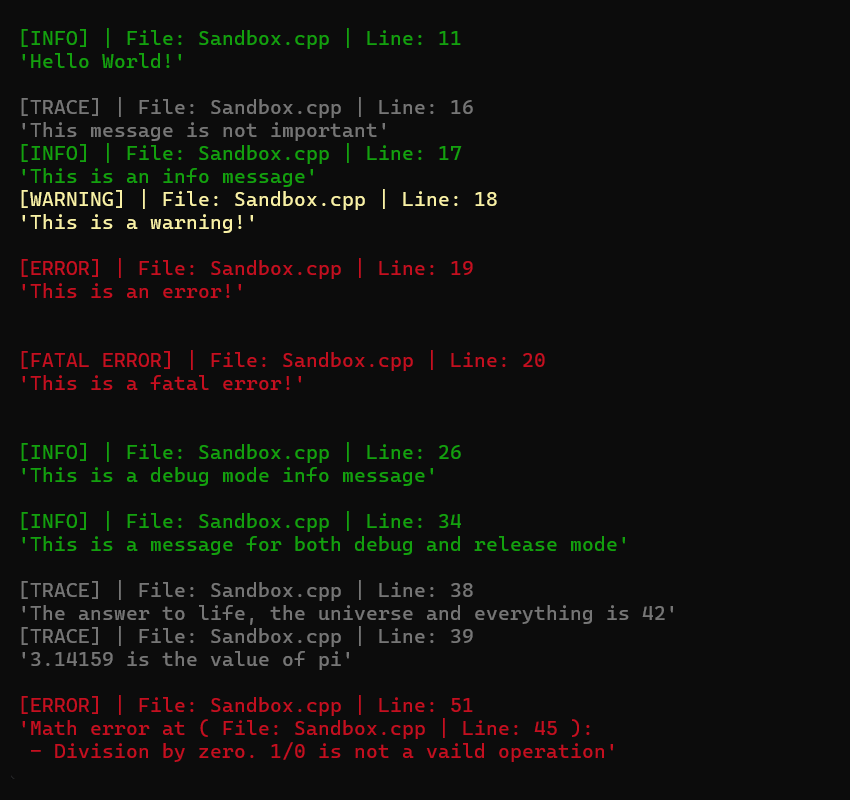

# Log Library

## General

This library provides a simple logging system, and some additional utility functionality for `C++` projects. The library is built using [Premake5](https://premake.github.io/) for `C++20`.

## Getting started

To build this library, clone the repository and run the provided `Premake5` script in the `dev` folder. If using `Windows` with `Visual Studio 2022`, there is a provided `bat` file that builds a solution file.

Open the project in your IDE of choice and build the project. The library will be built in the `bin` folder. Running the the `Sandbox` project will ensure that the library is working correctly.

## Usage

To use the library, include the `Log.h` header file in your project. The logger can be accessed from anywhere in your code.

Log messages include a severity level, information about the file and line number, and the message itself. This is displayed with suitable colors corresponding to the selected severity. The logger is also configured to only log messages for specified build types.



In addition to the logging functionality, there are also macros for throwing exceptions with messages. The exceptions are formatted in the same way as the log messages. Furthermore, there is basic functionality for timing code execution.

## Example of usage

Below is an example program that demonstrates how to use the logging system.

```c++
// Sandbox.cpp
#include "Log.h"

int main()
{
  // Author: Rasmus Hugosson
  // Date: 2025-03-17

  // Description: This is a simple example of how to use the logging system

  // Let's start by logging a simple message with the following macro
  AE_LOG_CONSOLE(AE_INFO, "Hello World!");
  AE_LOG_CONSOLE_NEWLINE();

  // There are 5 log levels: Trace, Info, Warning, Error, Fatal
  // The log levels are color coded and a tag is displayed before the message
  AE_LOG_CONSOLE(AE_TRACE, "This message is not important");
  AE_LOG_CONSOLE(AE_INFO, "This is an info message");
  AE_LOG_CONSOLE(AE_WARNING, "This is a warning!");
  AE_LOG_CONSOLE(AE_ERROR, "This is an error!");
  AE_LOG_CONSOLE(AE_FATAL, "This is a fatal error!");

  AE_LOG_CONSOLE_NEWLINE();

  // By default, the log messages are only displayed in the console in debug mode
  // But this can also be explicetly specified
  AE_LOG_CONSOLE_DEBUG(AE_INFO, "This is a debug mode info message");
  AE_LOG_CONSOLE_NEWLINE_DEBUG();

  // In release mode, only the release log messages are displayed
  AE_LOG_CONSOLE_RELEASE(AE_INFO, "This is a release mode info message");
  AE_LOG_CONSOLE_NEWLINE_RELEASE();

  // Messages can also be logged for both debug and release mode
  AE_LOG_CONSOLE_ALL(AE_INFO, "This is a message for both debug and release mode");
  AE_LOG_CONSOLE_NEWLINE_ALL();

  // Any data type with an overloaded << operator for std::ostream can be logged
  AE_LOG_CONSOLE(AE_TRACE, "The answer to life, the universe and everything is " << 42);
  AE_LOG_CONSOLE(AE_TRACE, 3.14159265359 << " is the value of pi");

  // This library also provides a way to throw exceptions with a message  	try
  {
    // The exception messages are specified in the same way as the log messages
    AE_THROW_MATH_ERROR("Division by zero. " << 1 << "/" << 0 << " is not a vaild operation");
  }

  catch (const std::exception& e)
  {
    // The exception can be caught as usual and the message can be logged
    AE_LOG_CONSOLE_ALL(AE_ERROR, e.what());
  }

  // Execution time can also be measured with the Timer class
  ae::Timer timer;
  timer.Start();

  // We can then make the thread sleep for a while
  ae::Time::Wait(1.0);

  // And then measure the elapsed time
  AE_LOG_CONSOLE(AE_INFO, "Elapsed time: " << timer.GetElapsedTime() << " s");

#ifdef AE_DIST
  // No messages are printed for distribution builds
  // If something is to be logged in a distribution build, it can be done with standard C++ functions
  std::cout << "This message is only displayed in distribution builds" << std::endl;
#endif // AE_DIST
  return 0;
}
```

## License

This library is licensed under the **Apache License 2.0**.  
See the [LICENSE](LICENSE) file in this repository for details.
