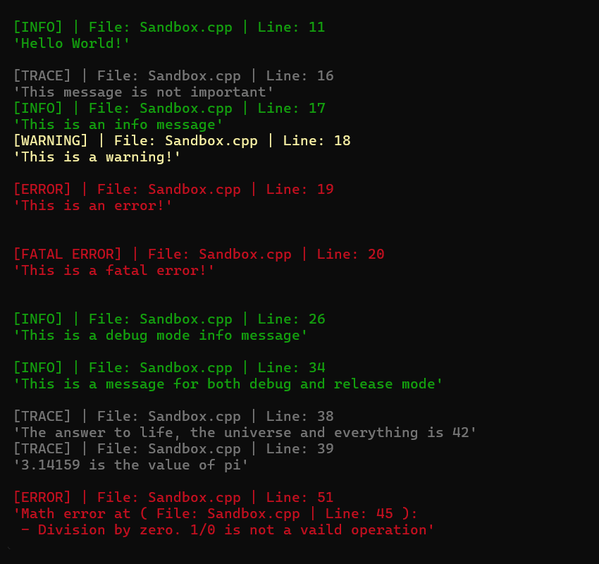

# Log Library

## General

This library provides a simple logging system, and some additional utility functionality for `C++` projects. The library is built using [Premake5](https://premake.github.io/) for `C++23`.

## Getting Started

1. **Clone the repository** and open a terminal in the project root.

The next steps depend on your preferred build system below.

### Visual Studio

2. Run `premake5 vs20XX` to generate a Visual Studio solution file (`.sln`).
3. Open the solution file in Visual Studio and build using MSVC.

### Gmake (force G++)

2. Run the pre-defined action `premake5 gmake-gcc` to generate makefiles specifically for GCC.
3. Navigate into `/build/[os]-gcc` where the `Makefile` is created.
4. Run `make config=[build type]` where the possible options are `debug`, `release` or `dist`.
5. Navigate into `/bin/Sandbox/[build type]` and run the `Sandbox` executable.
 
### Gmake (force Clang++)

2. Run the pre-defined action `premake5 gmake-clang` to generate makefiles specifically for Clang.
3. Navigate into `/build/[os]-clang` where the `Makefile` is created.
4. Run `make config=[build type]` where the possible options are `debug`, `release` or `dist`.
5. Navigate into `/bin/Sandbox/[build type]` and run the `Sandbox` executable.

### Formatting and Linting

There are additional actions for formatting with `clang-format` and linting through `clang-tidy`. These are run through:

```bash
# Run clang-format
premake5 format

# Run clang-tidy
premake5 lint

# Run clang-tidy and apply fixes
premake5 lint-fix
```

These commands assume `clang-format` and `clang-tidy` are installed on your system.

### Clangd

If you use `clangd` for intellisense and code completion, the provided `gen-build-cmds.sh` script will generate build commands for `clangd`. This will call `premake5 gmake-clang` and use `bear` to generate the build commands. Both `clang` and `bear` are assumed to be installed on your system.

### Additional Dependencies

- **Premake5:** This library uses [Premake5](https://premake.github.io/) as its build configuration tool.  
  Ensure that `premake5` is installed on your system or copied into the `root` folder.  
  You can download it [here](https://premake.github.io/download/).

## Using as a Submodule

This library can be used as a git submodule in other Premake5 projects. Add it as a submodule and include the Log project definition in your `premake5.lua`:

```lua
include("path/to/log-lib/log-project.lua")

project("YourProject")
    -- ...
    includedirs({ "path/to/log-lib/log-lib/include" })
    links({ "Log" })
```

The `log-project.lua` file defines only the Log project with automatic path resolution, while `premake5.lua` is used for standalone builds including the Sandbox example.

## Usage

To use the library, include the `Log.h` header file in your project. The logger can be accessed from anywhere in your code.

Log messages include a severity level, information about the file and line number, and the message itself. This is displayed with suitable colors corresponding to the selected severity. The logger is also configured to only log messages for specified build types.



Where logs are written is determined by adding sinks to the Logger singleton. Multiple console and/or file sinks with a specified severity range can be added to control what logs end up where. For example, this makes it possible to log everything to the console but only record the errors in a dedicated error file.  

In addition to the logging functionality, there are also macros for throwing exceptions with messages. The exceptions are formatted in the same way as the log messages. Furthermore, there is basic functionality for timing code execution.

### Build Configurations

The build configuration determines which logging macros are active:

| Configuration | Define        | Logging                                      |
|---------------|---------------|----------------------------------------------|
| `debug`       | `AE_DEBUG`    | `AE_LOG()` and `AE_LOG_BOTH()` are active    |
| `release`     | `AE_RELEASE`  | `AE_LOG_RELEASE()` and `AE_LOG_BOTH()` are active |
| `dist`        | `AE_DIST`     | All logging disabled                         |

Use `AE_LOG()` for debug-only messages, `AE_LOG_RELEASE()` for release-only, and `AE_LOG_BOTH()` for messages in both builds.

## Example

Below is some example code demonstrating basic usage.

```c++
#include "Log.h"

void Demo()
{
    // Author: Rasmus Hugosson
    // Date: 2025-12-06

    // Description: This is a simple example of how to use this library (see /sandbox/src/Sandbox.cpp for full demo)

    // Let's start by adding a sink where the logs will show up
    ae::Logger::Get().AddConsoleSink("Console", ae::LogSinkConsoleKind::STDOUT, AE_TRACE); // AE_TRACE means trace or higher severity will be logged here
    ae::Logger::Get().AddFileSink("Error file", "logs/errors.txt", AE_ERROR); // Only errors or fatal errors will be recorded here

    // Now we can log a simple message with the following macro
    AE_LOG(AE_INFO, "Hello World!");
    // A special macro is provided for blank lines since printing "\n" manually can result in incorrect formatting
    AE_LOG_NEWLINE();

    // There are 5 log levels: Trace, Info, Warning, Error, Fatal
    // The log levels are color coded and a tag is displayed before the message
    AE_LOG(AE_TRACE, "This message is not important");
    AE_LOG(AE_INFO, "This is an information message");
    AE_LOG(AE_WARNING, "This is a warning!");
    AE_LOG(AE_ERROR, "This is an error!");
    AE_LOG(AE_FATAL, "This is a fatal error!");

    AE_LOG_NEWLINE();

    // All log messages can be formatted through std::format, like using normal std::print
    AE_LOG(AE_TRACE, "The answer to life, the universe and everything is {}", 42);
    AE_LOG(AE_TRACE, "{} is the value of pi", 3.14159265359);
}
```

An extended example of how this library can be used is provided in `/sandbox/src/Sandbox.cpp`. See this file for further information regarding functionality.

## Supported Platforms

- Windows (MSVC)
- Linux (GCC / Clang)
- Likely MacOS (not yet tested, but ANSI branch is portable)

## License

This library is licensed under the **Apache License 2.0**.  
See the [LICENSE](LICENSE) file in this repository for details.
